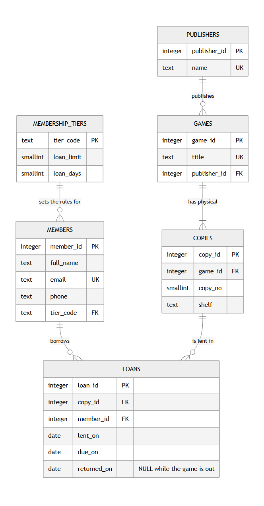
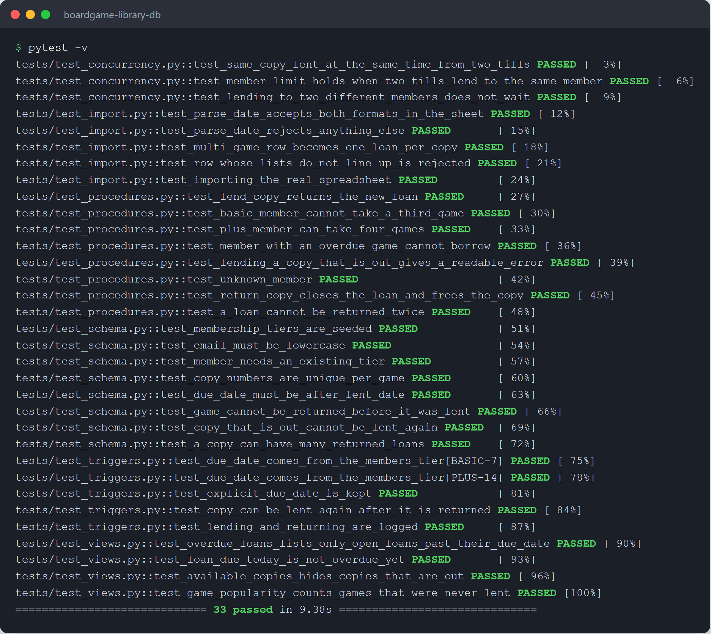

# boardgame-library-db

[](https://github.com/Yourdevdaniel/boardgame-library-db/actions/workflows/tests.yml)

A PostgreSQL database for the lending shelf of a (fictional) board-game café,
*Meeple & Mug*.

Members can take games home for a few days. Until now the staff tracked every
loan in one shared spreadsheet ([`data/cafe_loans_spreadsheet.csv`](data/cafe_loans_spreadsheet.csv)).
It mostly worked, but:

- the same member's phone number is typed differently in different rows,
- one cell sometimes holds three games at once (`Pandemic; Dixit; Splendor`),
- dates are a mix of `2026-07-02` and `03/07/2026`,
- nothing stops two people from "borrowing" the same physical copy.

This project moves that spreadsheet into a normalized schema and lets the
database enforce the lending rules, instead of trusting whoever is behind the
counter to remember them.



## What's in it

| Topic | Where | Notes |
|---|---|---|
| Normalization (UNF → 3NF) | [`docs/normalization.md`](docs/normalization.md) | Each step fixes a problem visible in the real sheet |
| Schema and constraints | [`sql/01_schema.sql`](sql/01_schema.sql) | Surrogate keys, `CHECK`s, a partial unique index |
| Views | [`sql/02_views.sql`](sql/02_views.sql) | `overdue_loans`, `available_copies`, `game_popularity` |
| Triggers | [`sql/03_triggers.sql`](sql/03_triggers.sql) | Due date from the member's tier (BEFORE), loan history log (AFTER) |
| Stored procedures | [`sql/04_procedures.sql`](sql/04_procedures.sql) | `lend_copy()` checks every rule; `CALL return_copy()` |
| Transactions and concurrency | [`docs/race-condition.md`](docs/race-condition.md), [`tests/test_concurrency.py`](tests/test_concurrency.py) | Two tills lending at the same moment, tested with two real connections |
| Query optimization | [`sql/05_indexes.sql`](sql/05_indexes.sql), [`docs/query-tuning.md`](docs/query-tuning.md) | `EXPLAIN ANALYZE` before/after on 500k loans |
| Data migration | [`import_spreadsheet.py`](import_spreadsheet.py) | One transaction; warns instead of silently "fixing" data |

## Running it

You need PostgreSQL 13 or newer (I developed on 17) and Python 3.10+.

```bash
python -m venv .venv
source .venv/bin/activate          # Windows: .venv\Scripts\activate
pip install -r requirements.txt

export DATABASE_URL=postgresql://postgres@localhost:5432/boardgame_library
python db.py                       # drops and rebuilds the database from sql/
python import_spreadsheet.py       # loads the café's spreadsheet
```

Then, in `psql`:

```sql
SELECT * FROM available_copies;
SELECT lend_copy(1, 3);            -- member 1 borrows copy 3, returns the loan_id
CALL return_copy(43);
SELECT * FROM overdue_loans;
SELECT * FROM game_popularity ORDER BY times_lent DESC;
```

### Tests

```bash
export TEST_DATABASE_URL=postgresql://postgres@localhost:5432/boardgame_library_test
pytest
```

The test run **drops and re-creates** the database in `TEST_DATABASE_URL`,
so point it at a throwaway name. Most tests run inside a transaction that is
rolled back; the concurrency tests need committed rows, so they empty the
tables afterwards instead.

GitHub Actions runs the same suite on every push, with PostgreSQL 17 as a
service container ([`tests.yml`](.github/workflows/tests.yml)).



### A bigger dataset

```bash
python db.py && python seed_bulk.py   # 20k members, 500k loans, ~30 s
```

## Decisions worth explaining

- **The loan limit lives on the membership tier, not the member.** The sheet
  had a Basic member with a 3-game limit when Basic allows 2. That row was a
  transitive dependency showing up as a bug. ([normalization](docs/normalization.md))
- **A unique index instead of a trigger for "one open loan per copy".** My
  first version was a trigger with an `EXISTS` check. It passed every
  single-connection test and failed the two-connection one: under READ
  COMMITTED, neither till can see the other's uncommitted loan. A partial
  unique index does see it. ([race condition](docs/race-condition.md))
- **A row lock for the loan limit.** "At most N open loans per member" can't
  be a unique index, so `lend_copy` locks the member row with
  `SELECT ... FOR UPDATE OF m`. The `OF m` matters: a plain `FOR UPDATE`
  would also lock the tier row and make every Basic member's loan wait for
  every other one. There's a test for that.
- **`lend_copy` is a function, `return_copy` is a procedure.** Lending has to
  hand back the new `loan_id`; returning has nothing to return.
- **Foreign keys needed their own indexes.** PostgreSQL doesn't create them
  automatically. A member's history went from a ~100 ms sequential scan to
  ~2.6 ms. ([query tuning](docs/query-tuning.md))

## What I'd do next

- A `staff` database role that can only `EXECUTE` the functions and read the
  views, with no direct `INSERT` on `loans`, so the rules can't be bypassed.
- Reservations ("call me when Wingspan is back") as a queue per game.
- Timestamps instead of dates, if the café ever wants hourly in-store rentals.

## Screenshots

Everything in [`screenshots/`](screenshots/) was generated from real runs of
the code in this repository.
