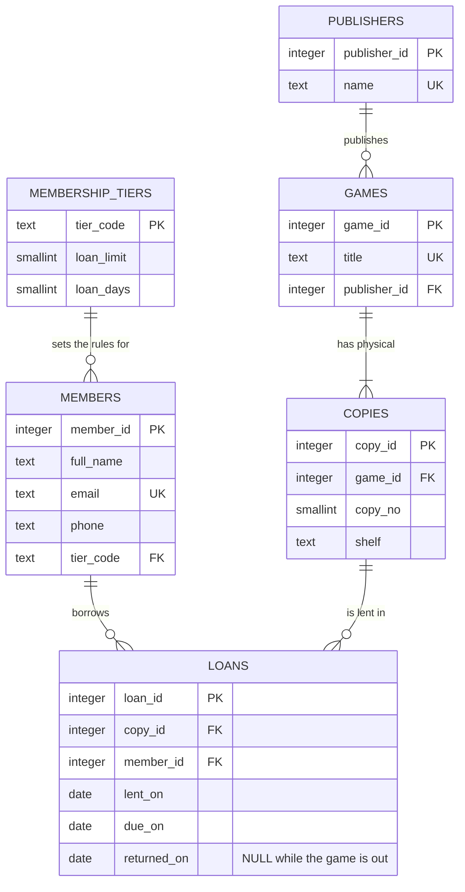

# ER diagram

GitHub renders this Mermaid block as a diagram. A PNG copy lives in
`screenshots/er-diagram.png`.

```mermaid
erDiagram
    MEMBERSHIP_TIERS ||--o{ MEMBERS : "sets the rules for"
    MEMBERS ||--o{ LOANS : borrows
    PUBLISHERS ||--o{ GAMES : publishes
    GAMES ||--|{ COPIES : "has physical"
    COPIES ||--o{ LOANS : "is lent in"

    MEMBERSHIP_TIERS {
        text tier_code PK
        smallint loan_limit
        smallint loan_days
    }
    MEMBERS {
        integer member_id PK
        text full_name
        text email UK
        text phone
        text tier_code FK
    }
    PUBLISHERS {
        integer publisher_id PK
        text name UK
    }
    GAMES {
        integer game_id PK
        text title UK
        integer publisher_id FK
    }
    COPIES {
        integer copy_id PK
        integer game_id FK
        smallint copy_no
        text shelf
    }
    LOANS {
        integer loan_id PK
        integer copy_id FK
        integer member_id FK
        date lent_on
        date due_on
        date returned_on "NULL while the game is out"
    }
```
