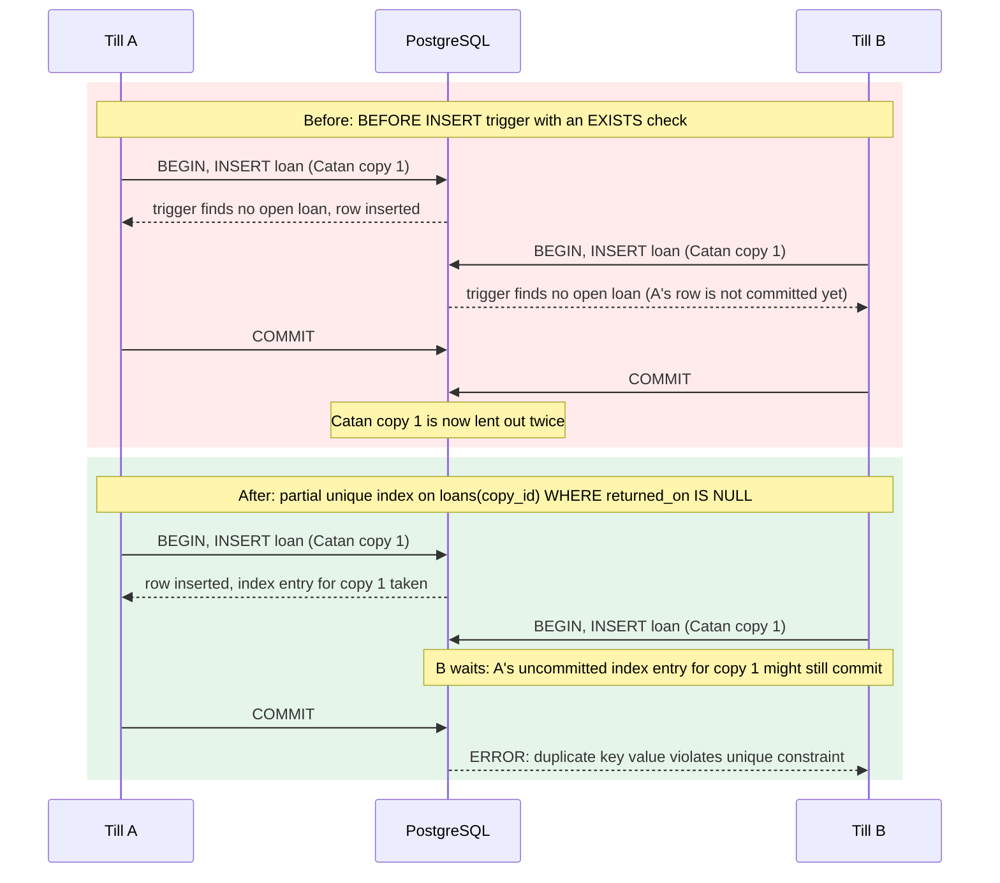

# The "two tills" race condition

Reproduced in `tests/test_concurrency.py`. PostgreSQL's default isolation
level is READ COMMITTED: a statement only sees rows that were committed
before it started. That is exactly what broke the first version of the
"one open loan per copy" rule, which was a trigger doing an `EXISTS` check.

## Why not just lock the row?

`SELECT ... FROM copies WHERE copy_id = $1 FOR UPDATE` before inserting
would also serialize the two tills, but only for code that remembers to
take the lock. The unique index protects every insert, including one typed
by hand in psql.

## The second race: the member loan limit

"At most 2 open loans for a Basic member" can't be a unique index, so the
same bug came back one level up: two tills running `lend_copy` for the same
member both counted 1 open loan and both lent (3 games on a 2-game plan).

Here the lock *is* the right tool. `lend_copy` starts with
`SELECT ... FROM members m JOIN membership_tiers t ... FOR UPDATE OF m`.
The second till waits on that line; when it gets the lock, the first loan is
committed, and because READ COMMITTED takes a fresh snapshot for every
statement, its `count(*)` sees it and the lend is refused.

`OF m` limits the lock to the member row. Without it, PostgreSQL also locks
the joined `membership_tiers` row, and every loan to *any* Basic member
would wait for every other one. `test_lending_to_two_different_members_does_not_wait`
fails if you remove it.
